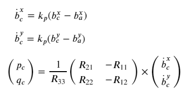
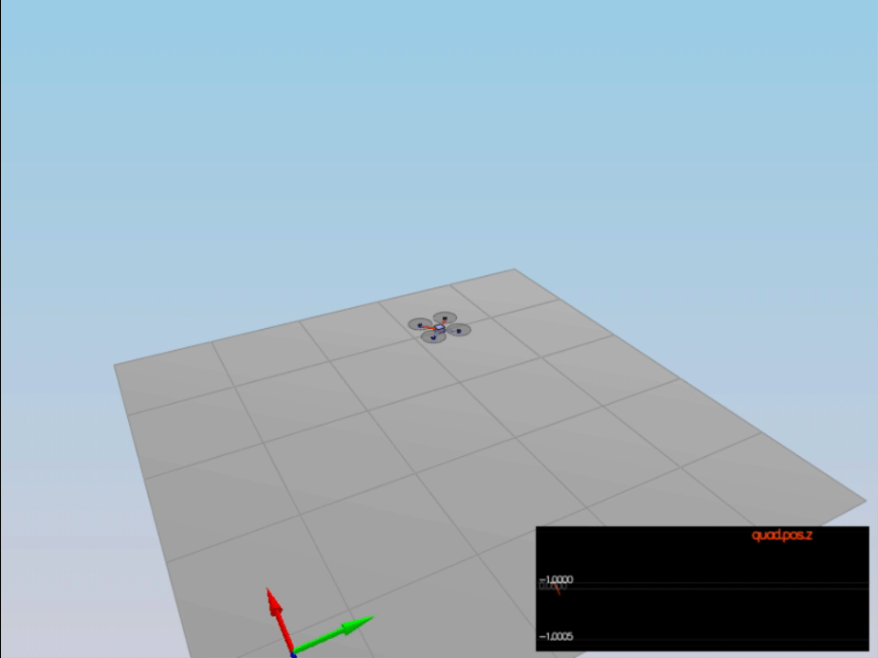
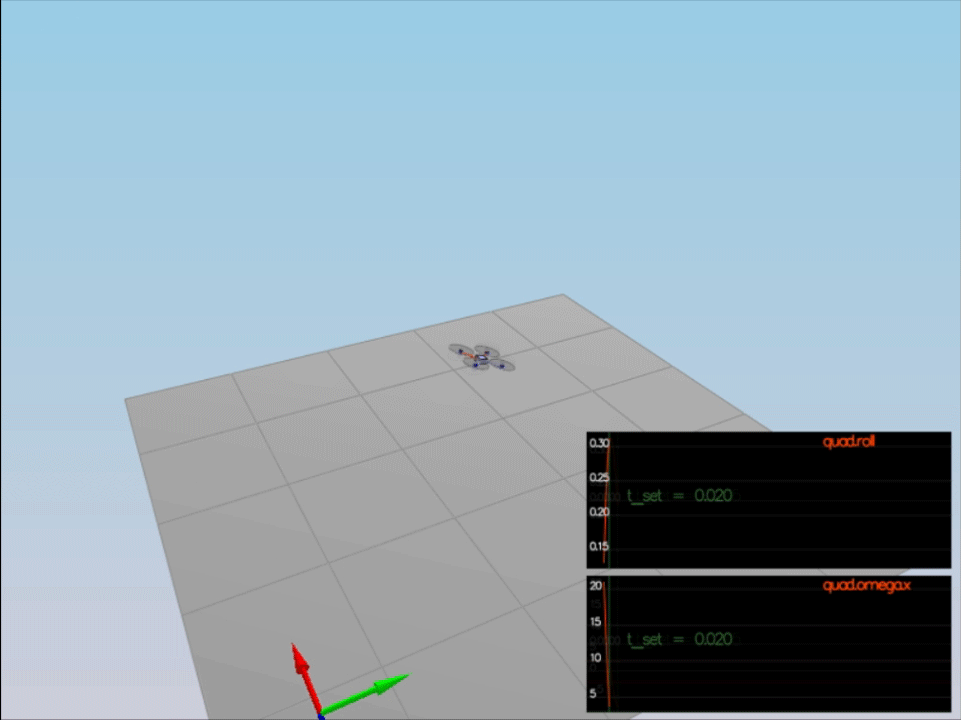
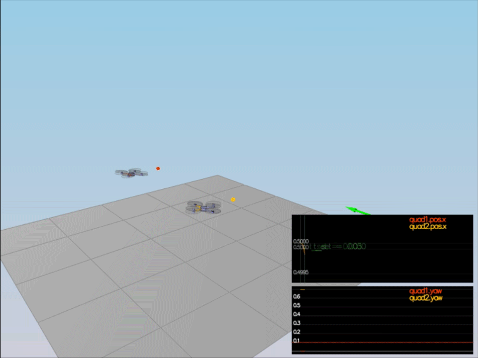
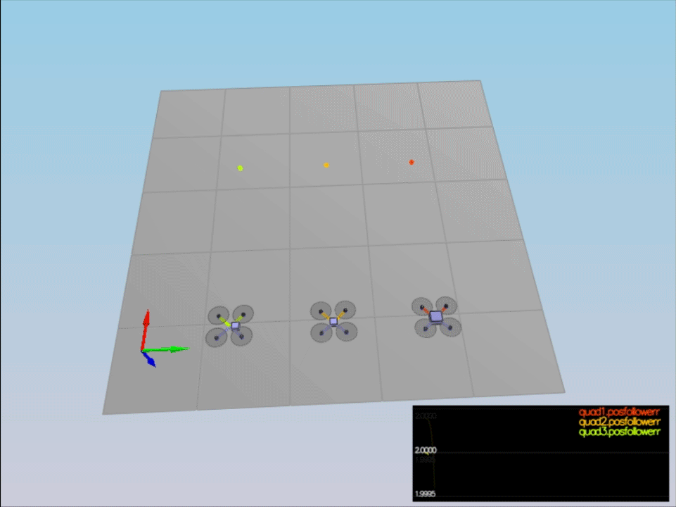
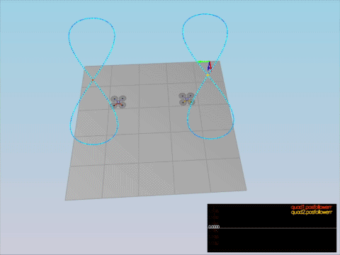

# The "FCND-Controls-CPP" C++ Project Writeup #

This is the readme/writeup for the "FCND-Controls-CPP" C++ project.

The original README.md is available [here](README_original.md)

For easy navigation throughout this document, here is an outline:

 - [Rubric Points](#rubric-points)
     - [Results](#3-flight-evaluation)
 - [Extra Challenge 1](#extra-Challenge-1)
 - [Extra Challenge 2](#extra-Challenge-2)


## [Rubric](https://review.udacity.com/#!/rubrics/1643/view) points

### 1. Writeup / README

#### 1.1. Provide a Writeup / README that includes all the rubric points and how you addressed each one. You can submit your writeup as markdown or pdf.
<sub>_The writeup / README should include a statement and supporting figures / images that explain how each rubric item was addressed, and specifically where in the code each step was handled._</sub>

You're reading it! Below I describe how I addressed each rubric point and where in my code each point is handled.


### 2. Implemented Controller

#### 2.1. Implemented body rate control in C++.
<sub>_The controller should be a proportional controller on body rates to commanded moments. The controller should take into account the moments of inertia of the drone when calculating the commanded moments._</sub>

There is a function `BodyRateControl()` in `QuadControl.cpp`, which implements this controller.
```c++
V3F I(Ixx, Iyy, Izz);
momentCmd = I * kpPQR * (pqrCmd - pqr);
```
The moments of inertia `V3F I(Ixx, Iyy, Izz)` are used for transforming body rates into moments. 
 
 
#### 2.2. Implement roll pitch control in C++.
<sub>_The controller should use the acceleration and thrust commands, in addition to the vehicle attitude to output a body rate command. The controller should account for the non-linear transformation from local accelerations to body rates. Note that the drone's mass should be accounted for when calculating the target angles._</sub>

Function `RollPitchControl()` in `QuadControl.cpp` does exactly this.
```c++
// Converting force into acceleration. Minus due to Z axis pointing downwards.
float c = -collThrustCmd / mass;

float b_a_x = R(0, 2);
float b_a_y = R(1, 2);
float b_c_x = accelCmd[0] / c;
float b_c_y = accelCmd[1] / c;

b_c_x = CONSTRAIN(b_c_x, -maxTiltAngle, maxTiltAngle);
b_c_y = CONSTRAIN(b_c_y, -maxTiltAngle, maxTiltAngle);

float b_c_dot_x = kpBank * (b_c_x - b_a_x);
float b_c_dot_y = kpBank * (b_c_y - b_a_y);

pqrCmd.x = (b_c_dot_x * R(1, 0) - b_c_dot_y * R(0, 0)) / R(2, 2);
pqrCmd.y = (b_c_dot_x * R(1, 1) - b_c_dot_y * R(0, 1)) / R(2, 2);
```
First the thrust command is converted into acceleration using `-1/mass` coefficient.
Target b<sub>c</sub> must be constrained to be in `(-maxTiltAngle, maxTiltAngle)`.

Then `p` and `q` are calculated using the following formulas:




#### 2.3. Implement altitude controller in C++.
<sub>_The controller should use both the down position and the down velocity to command thrust. Ensure that the output value is indeed thrust (the drone's mass needs to be accounted for) and that the thrust includes the non-linear effects from non-zero roll/pitch angles._</sub>

<sub>_Additionally, the C++ altitude controller should contain an integrator to handle the weight non-idealities presented in scenario 4._</sub>

Function `AltitudeControl()` in `QuadControl.cpp` represents this PID controller.

```c++
float ePos = posZCmd - posZ;
float eVel = velZCmd - velZ;
integratedAltitudeError += ePos * dt;

float u_bar = kpPosZ * ePos + kpVelZ * eVel + KiPosZ * integratedAltitudeError + accelZCmd;

float c = (u_bar - 9.81f) / R(2, 2);
// Limiting asc/desc rates using `x_dot_dot = d(x_dot) / dt`
c = CONSTRAIN(c, -maxDescentRate / dt, maxAscentRate / dt);

// Converting acceleration to force. Z axis -> downwards!
thrust = -c * mass;
```

`u_bar` variable is calculated using the P, D and I gains and the provided Feed Forward acceleration.
Calculated acceleration `c` is first being constrained by `maxDescent` and `maxAscent` rates
(which are transformed to velocities using `dt` argument)
and then transformed into force before returning.

Integration Z error is collected over time in `integratedAltitudeError` variable.


#### 2.4. Implement lateral position control in C++.
<sub>_The controller should use the local NE position and velocity to generate a commanded local acceleration._</sub>

Lateral controller is implemented in `LateralPositionControl()` function in `QuadControl.cpp`.
```c++
float velCmdMag = velCmd.mag();
if (velCmdMag > maxSpeedXY)
    velCmd *= maxSpeedXY / velCmdMag;

V3F ePos = posCmd - pos;
V3F eVel = velCmd - vel;
accelCmd += kpPosXY * ePos + kpVelXY * eVel;

float accelCmdMag = accelCmd.mag();
if (accelCmdMag > maxAccelXY)
    accelCmd *= maxAccelXY / accelCmdMag;
```
This is a quite basic PD controller with two constraints:
1. Magnitude of velocity vector must be ≤ `maxSpeedXY`.
2. Magnitude of acceleration vector must be ≤ `maxAccelXY`.

The Z component of both is set to 0 outside of 'student code' block of code.


#### 2.5. Implement yaw control in C++.
<sub>_The controller can be a linear/proportional heading controller to yaw rate commands (non-linear transformation not required)._</sub>

Function `YawControl()` in file `QuadControl.cpp` is responsible for the yaw controller.

```c++
yawRateCmd = kpYaw * fmodf(yawCmd - yaw, M_PI);
```

This is a very basic P controller for controlling yaw of the quad.

`fmodf()` function is used to unwrap angle to the range `(-PI, PI)`.


#### 2.6 Implement calculating the motor commands given commanded thrust and moments in C++.
<sub>_The thrust and moments should be converted to the appropriate 4 different desired thrust forces for the moments. Ensure that the dimensions of the drone are properly accounted for when calculating thrust from moments._</sub>

The code for this part can be found in `GenerateMotorCommands()` function in `QuadControl.cpp`.

```c++
const float l = L * sin(0.25 * M_PI);

// These <tx, ty, tz> are defined with 0.25f multiplier for optimization
float tx = 0.25f * momentCmd[0] / l;
float ty = 0.25f * momentCmd[1] / l;
float tz = 0.25f * momentCmd[2] / kappa;
float F = 0.25f * collThrustCmd;

float f1 = tx + ty - tz + F;
float f2 = -tx + ty + tz + F;
float f3 = -tx - ty - tz + F;
float f4 = tx - ty + tz + F;

// 2nd and 3rd are swapped due to different motor enumeration
cmd.desiredThrustsN[0] = f1; // front left
cmd.desiredThrustsN[1] = f2; // front right
cmd.desiredThrustsN[3] = f3; // rear right
cmd.desiredThrustsN[2] = f4; // rear left
```

First of all convert `L` to `l` such that it corresponds to arm length
with which motors impact to rotational rates of quad: `l = L*sin(pi/4)`

The rest of code corresponds to the following logic.

**1. Notation:**

`F = collThrustCmd  [N]` - collective thrust of motors

`<tau_x, tau_y, tau_z> = momentCmd  [N m]` - desired rotation moments

`<F1, F2, F3, F4> = desiredThrustsN [N]` - commanded thrusts to motors

**2. Difining _kappa_:**

From `F = k_f * omega^2` and `tau = k_m * omega^2` having:

`tau / F = k_m / k_f = kappa` => `tau_i = kappa * F_i`

**3. Getting all the inputs together in equations**

Do not forget that direction of vehicle is the opposite of rotation of props.

```
tau_x = (F1 - F2 - F3 + F4) * l
tau_y = (F1 + F2 - F3 - F4) * l
tau_z = -tau_1 + tau_2 - tau_3 + tau_4 = (-F1 + F2 - F3 + F4) * kappa
F = F1 + F2 + F3 + F4
```

**4. Simplification notation:**

```
tx = tau_x / l
ty = tau_y / l
tz = tau_z / kappa
```

**5. Solving system of linear equations**

```
A = [[1, -1, -1, 1],
     [1, 1, -1, -1],
     [-1, 1, -1, 1],
     [1, 1, 1, 1]]
X = [F1, F2, F3, F4].T
B = [tx, ty, tz, F].T

AX=B  => X = (A^-1)B

A^-1 = [[ 0.25,  0.25, -0.25,  0.25],
        [-0.25, 0.25, 0.25, 0.25],
        [-0.25, -0.25, -0.25, 0.25],
        [0.25, -0.25, 0.25, 0.25]]
```

**6. Calculating desired thrusts**

```
F1 = tx + ty - tz + F;
F2 = -tx + ty + tz + F;
F3 = -tx - ty - tz + F;
F4 = tx - ty + tz + F;
```

### 3. Flight Evaluation ###

#### 3.1. Your C++ controller is successfully able to fly the provided test trajectory and visually passes inspection of the scenarios leading up to the test trajectory.
<sub>_Ensure that in each scenario the drone looks stable and performs the required task. Specifically check that the student's controller is able to handle the non-linearities of scenario 4 (all three drones in the scenario should be able to perform the required task with the same control gains used)._</sub>

In all scenarios (#1-5) drones successfully pass all required tasks.

All scenario-specific config files stay untouched (except for 5<sup>th</sup> scenario, more on this in [5_TrajectoryFollow](#scenario-5_trajectoryfollow) section).
In `QuadControlParams.txt` only `Mass` parameter was changed (as stated in [testing task fomulation](https://github.com/udacity/FCND-Controls-CPP#testing-it-out))
and all PID gains.

##### Scenario 1_Intro
Changing `Mass` from `0.4` to `0.5` solves hover problem.



##### Scenario 2_AttitudeControl

In this test quad has to stabilize its `roll` and `omega.x` parameters for specified amount of time.



##### Scenario 3_PositionControl

In this test 2 quads have to reach specified positions (x-coordinate and yaw)


    
##### Scenario 4_Nonidealities

This test checks how quads behaves with non-ideal parameters (such as shifted CM or overweight)



##### Scenario 5_TrajectoryFollow #####

In this scenario drone has to follow "8" shaped trajectory.

The second quad uses `FigureEightFF.txt` trajectory, which is given as a project file.

The first quad uses `FigureEight.txt` trajectory, which has been generated with `MakePeriodicTrajectory.py` script.
It increases the speed of trajectory by 50% (meaning, that first quad has to move 1.5 times faster than the second one).

In order to increase the response of the first quad the `5_TrajectoryFollow.txt` file has been changed.
The changes are that Quad1 loads `QuadControlParamsFast` configuration with more aggressive PID gains.




## Extra Challenge 1

<sub>_1. Inspect the python script traj/MakePeriodicTrajectory.py. Can you figure out a way to generate a trajectory that has velocity (not just position) information?_</sub>

`MakePeriodicTrajectory.py` has some changes inside, namely, some code restructure
and adding velocity information to trajectory that is got written into trajectory file.
Velocity is calculated by differentiating position, namely, `velocity = (pos_current - pos_previous) / timestep`.

<sub>_2. Generate a new FigureEightFF.txt that has velocity terms. Did the velocity-specified trajectory make a difference? Why?_</sub>

A new `FigureEightFF.txt` has been generated with `MakePeriodicTrajectory.py` script and saved as `FigureEight.txt`.
Each line contains the velocity terms followed by position terms.

Yes, velocity-specified trajectory highly increases the quad's following accuracy.
This is happening because these velocities are used as inputs to **Altitude Controller**
and **Lateral Position Controller** and "tells" quad which speed it is going to have at this trajectory point
(which means that it does not need "stop" at every point, but can easily fly through).
From math's point of view: _velocityCmd_ vector is going to be closer to _velocityActual_ vector,
which means that velocity part of PID-controller equation is low,
and proportional and integral parts are making bigger impacts.
(or intuitively differential part does not impact much trying to stop quad at each trajectory point).
 
 Please, refer to description of [5_TrajectoryFollow](#scenario-5_trajectoryfollow) in Results part to check
 what changes have been performed in 5<sup>th</sup> scenario relating this challenge.
 
 
## Extra Challenge 2
<sub>_1. For flying a trajectory, is there a way to provide even more information for even better tracking?_</sub>

Yes, e.g. the acceleration can be calculated for each trajectory point.
It will be passed into **Altitude Controller** and **Lateral Position Controller**
(the same way as velocity information) and used as Feed Forward term in PID equation.

Another option is to calculate vehicle's attitude at each point.
This will affect quad's yaw in current implementation.
The result will as quad persuades trajectory points with its front side.
However, this is not going to increase the accuracy of tracking (at least much),
rather than it is a one another option how quad can follow trajectory points.

Specifying rotation angles and/or rotation rates might somehow help quad predict its best attitude in each trajectory point.
However, in order to make use of this information we need to change the structure of the whole quad controller.
This is necessary because we will need to somehow merge rates proposed by Attitude Controller with those specified at trajectory point.

<sub>_2. How about trying to fly this trajectory as quickly as possible (but within following threshold)!_</sub>

Please, check the description of [5_TrajectoryFollow](#scenario-5_trajectoryfollow) in Results part,
where the 1<sup>st</sup> quad tracks 1.5 times faster trajectory.